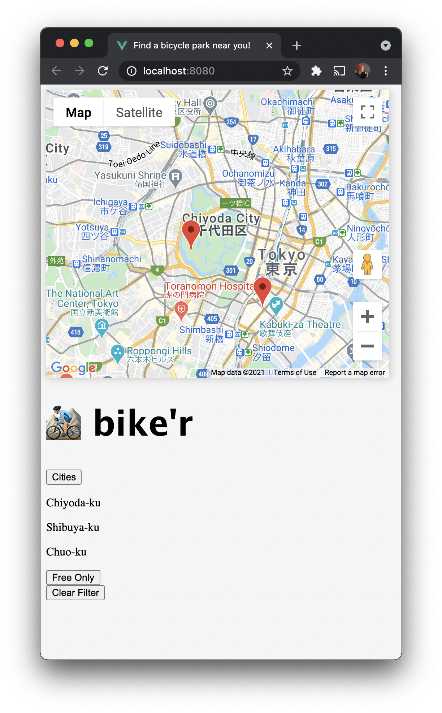

<b>☝🏻 bike'r is a 1-man, work-in-progress 'MVP' concept started during a 3-day sprint at Code Chysalis Immersive Bootcamp. ReadMe will be updated to reflect changes gradually.
</b>
<br>

# bike'r

Tokyo has great streets for biking. But unfortunately scarce and expensive parking.

bike'r is a mobile-friendly tool that overlays crowdsourced bike parking on Google Maps. Whether legit parking, or just unregulated space where you won't get towed; visit the app here and transform your commute.

bike'r will be deployed on Heroku with URL located here.

## Progress:
✅ User can see a map of nearby bike parking.

👨🏼‍💻 User can filter parking by city or price

😅 User can see the price of the park

😅 User can submit a new location for review



## Tech Stack:
- Front End
  - Vue + Vuex
  - Vuetify (pending)
- Back End
  - Node/Express
  - Knex + PostgreSQL (pending)
- Deployment
  - Heroku

## Want to give it a try?

1. First clone the repository to your local machine
```
git clone https://github.com/sethwright/cc17-solompv.git
```

2. Install all dependencies
```
npm install
```

3. This app requires developer keys from Google Maps API, please refer to the [official documentation](https://developers.google.com/maps/documentation/javascript/cloud-setup) for more info.

4. Once you have your keys, it can be placed in src/main.js where indicated.

Run the location server (currently spoofed with no DB):
```
npm start
```
(Or run server in development mode):
```
npm run dev
```
After the server is running, run the client:
```
npm run client
```
